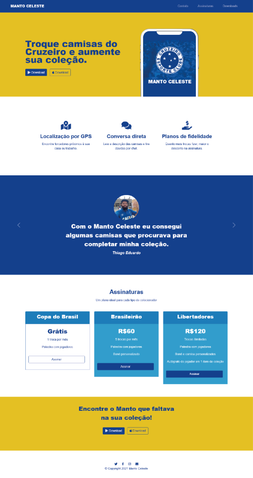

# Manto Celeste   

Publicado em [Manto Celeste](https://mantoceleste.netlify.app/)

    
  
  ---

   &nbsp; &nbsp;
   &nbsp; &nbsp;
  &nbsp; &nbsp;

### Projeto desenvolvido durante os módulos Bootstrap do curso [**"The Complete 2021 Web Development Bootcamp"**](https://www.udemy.com/course/the-complete-web-development-bootcamp/), disponível na Udemy. ###
 

---

## Sobre o projeto ##

Site de divulgação para o aplicativo fictício "Manto Celeste", voltado para torcedores colecionadores de camisas de futebol.

O objetivo do projeto era conhecer e aplicar conhecimentos básicos e intermediários do Bootstrap, assim como aprofundar alguns conhecimentos em HTML e CSS.

Acesse: [Manto Celeste](https://mantoceleste.netlify.app/)

## Screenshot ##

 

---

## Autoria ##

<b>Daniella Salles</b>
 

---
